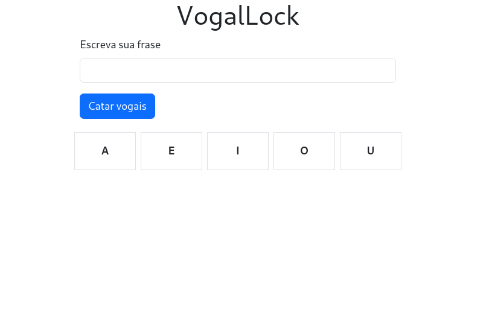
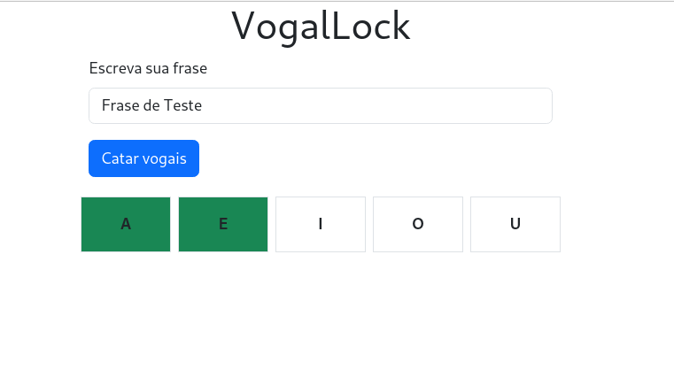

# VogalLock

### Sobre
Este é um projeto que utiliza JS para análisar a palavra ou frase, e demonstra quais vogais ela possui

## Tecnologias
-HTML
-CSS
-JAVASCRIPT

## Screenshots




## Como rodar este projeto

### Clone e entre no repositorio
```bash
    git clone https://github.com/LacamJC/VogalLock.git
    cd VogalLock
```

### Entre no arquivo index.html em seu naveador e aproveite !